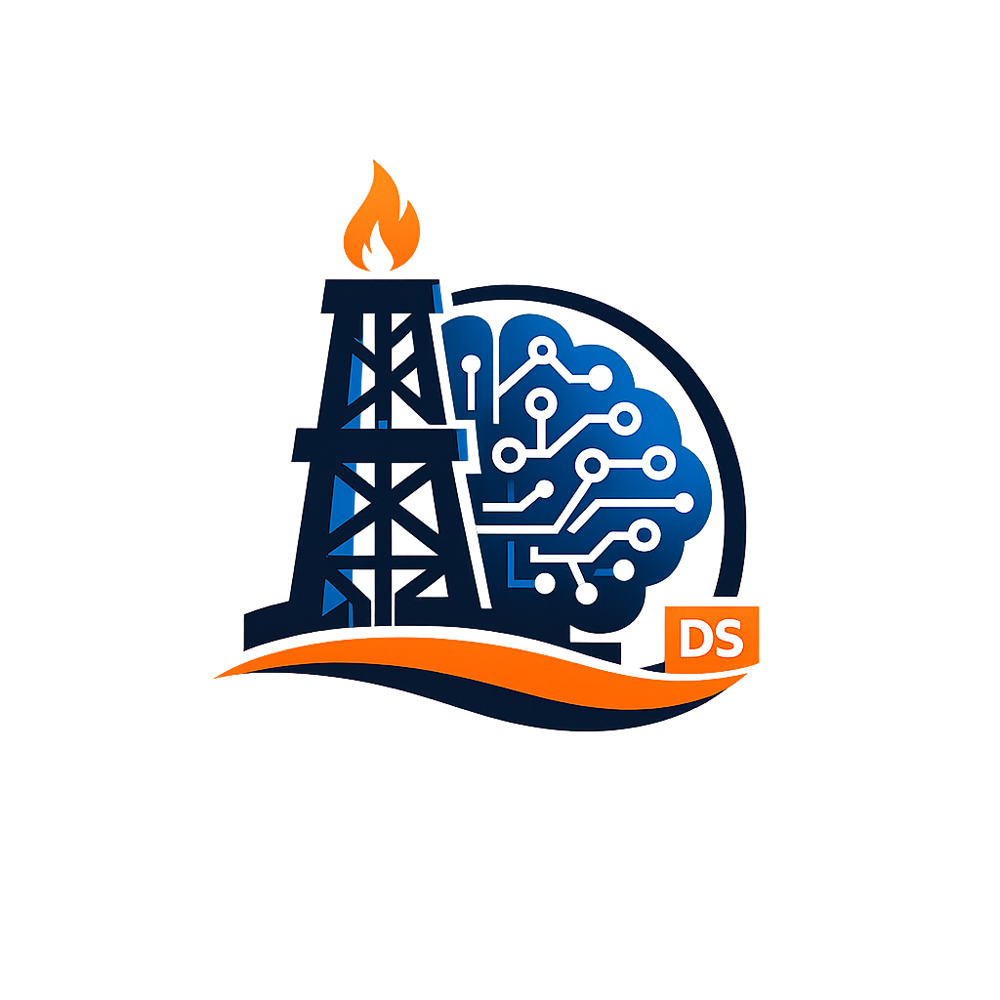
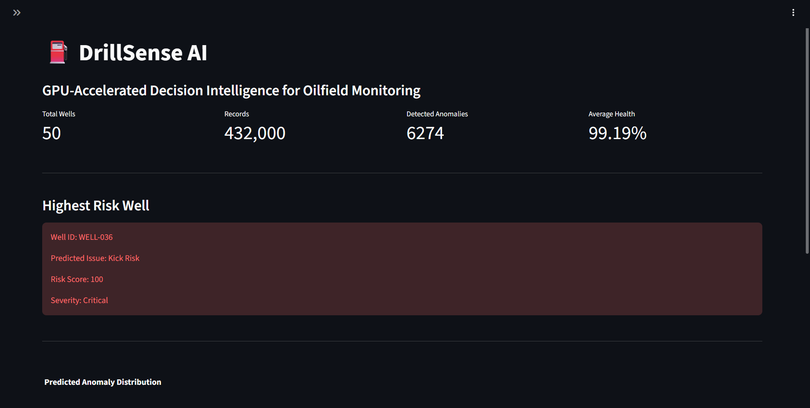

#  DrillSense AI

### GPU-Accelerated Decision Intelligence for Oilfield Monitoring


---

## Dashboard

<p align="center">

</p>

---

## Overview

DrillSense AI is a cloud-native, AI-powered oilfield monitoring platform that combines machine learning, GPU acceleration, Google Cloud, and Gemini 2.5 Flash to detect drilling anomalies, assess operational risk, and generate engineering recommendations. 
The platform demonstrates how modern AI can support production engineers through intelligent monitoring, predictive analytics, and cloud-scale decision intelligenc

---

## Key Features

- Executive Dashboard for operational monitoring
- Interactive Well Explorer with sensor trend visualization
- Gemini-powered AI Engineering Reports
- Machine Learning anomaly detection using Isolation Forest
- XGBoost-based operational risk prediction
- GPU benchmarking with NVIDIA Tesla T4 and RAPIDS cuDF
- Cloud-native architecture using Google Cloud Run
- BigQuery-backed analytics for scalable data processing

---

## Technology Stack

| Layer | Technology |
|------|------------|
| Programming Language | Python |
| Frontend | Streamlit |
| Data Visualization | Plotly |
| Machine Learning | XGBoost, Isolation Forest |
| Generative AI | Gemini 2.5 Flash |
| Cloud Platform | Google Cloud Platform (GCP) |
| Data Warehouse | BigQuery |
| Cloud Deployment | Cloud Run |
| Containerization | Docker |
| GPU Analytics | NVIDIA Tesla T4 + RAPIDS cuDF |
| Version Control | Git & GitHub |

---

## Workflow

```text
Sensor Data
      │
      ▼
Feature Engineering
      │
      ▼
Anomaly Detection
      │
      ▼
Risk Prediction
      │
      ▼
AI Decision Intelligence
      │
      ▼
Cloud Deployment
```

---

## Repository Structure

```
DrillSense-AI/
│
├── app/
│   ├── main.py
│   ├── gemini_utils.py
│   └── data_loader.py
│
├── assets/
│   ├── logo.png
│   └── dashboard.png
│
├── notebooks/
│
├── Dockerfile
├── cloudbuild.yaml
├── requirements.txt
├── README.md
├── LICENSE
├── .gitignore
└── .dockerignore
```

---

## Future Enhancements

- Live streaming data
- Predictive maintenance scheduling
- Automated alert notifications
- Multi-well fleet monitoring
- Enhanced engineering dashboard
- Time-series forecasting

---

## License

This project is licensed under the MIT License.

---
Om Tripathi